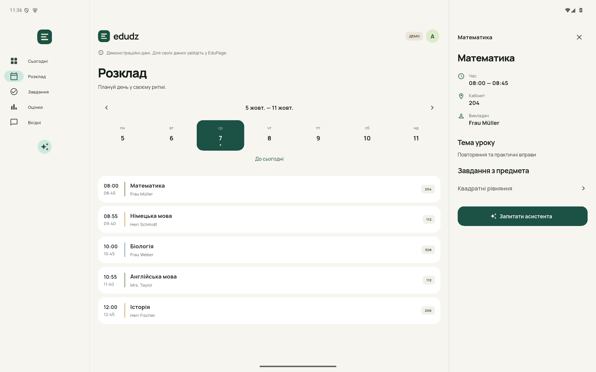
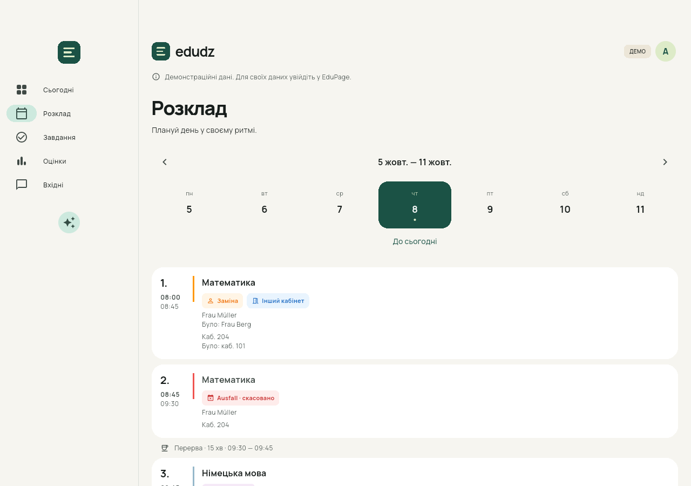
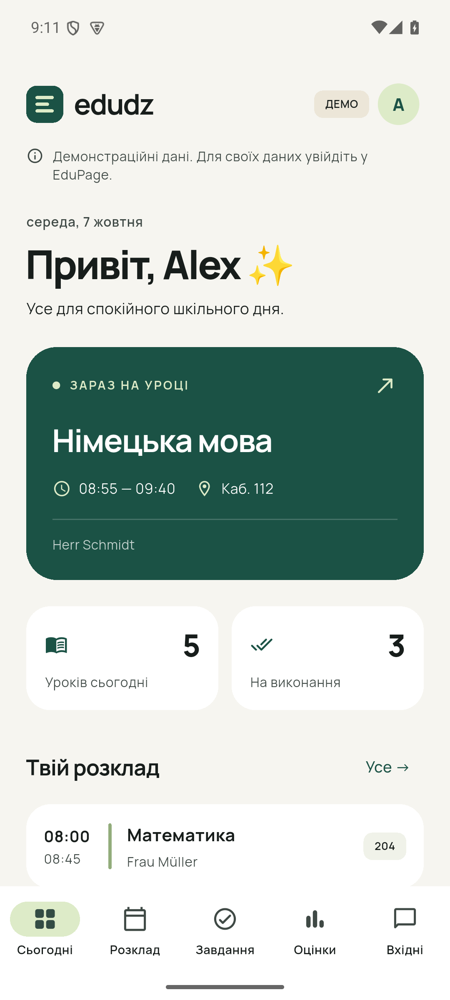
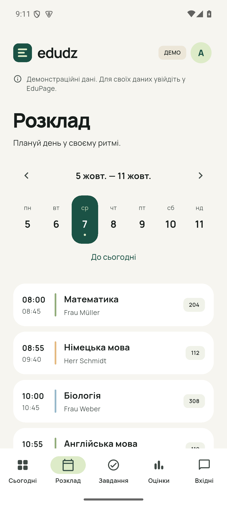
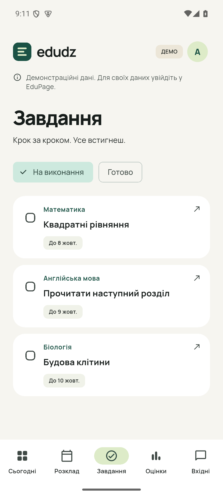

# edudz

A calm, self-hosted EduPage companion for Android. A real fork of
[DislikesSchool/EduPage2](https://github.com/DislikesSchool/EduPage2), with a new
interface and our existing EduPage2 backend.

**[Download the Android APK](https://github.com/Imlokzu/edudz/releases/latest)**

## Using edudz

1. Install the release APK on Android 7.0 or newer.
2. Enter your EduPage username and password. The school address is optional:
   our server can discover it from your global EduPage account. Enter a school
   address only when your school uses a local account.
3. Your timetable, homework, grades and messages load from your school through
   our own backend at `https://ep2.waveio.me`.

The demo on the sign-in screen is explicitly labeled and uses sample data.
Use the avatar to switch Ukrainian, English or German, choose a dark theme,
refresh your data, or sign out.

## What's in this fork

- Redesigned Today, Schedule, Tasks, Grades and Inbox screens.
- Double lessons appear as separate 45-minute periods with their real numbers.
- A live lesson/break countdown, lessons remaining, and school start/end times.
- School breaks at 09:30–09:45, 11:15–11:30 and 13:00–14:00, with separate
  free-time segments when lessons are cancelled or missing.
- Published substitution, room/class/subject changes and Ausfall markers;
  original teacher/room values are shown in rows and details. Cancelled lessons
  stay visible and do not count as lessons to attend.
- While open, the schedule refreshes about once a minute; open lesson details
  follow the updated school data. Each tab retains its own scroll position.
- The full day timetable with actual breaks and free periods between lessons.
- After school, Today automatically shows the next actual school day, skipping
  weekends and holidays published by the school. Manual timetable browsing stays available.
- Tablet navigation rail and a detail panel beside the timetable/homework list.
- Tap lessons for the room, teachers, class/group, published topic and related tasks.
- Full homework material cards, PDF/image/text previews and Office text previews.
- Save original attachments directly to Android Downloads/edudz (Android 10+);
  Android 7–9 uses the system save dialog. No school website redirect.
- A streaming school assistant with authenticated read tools for schedules,
  homework, grades, messages, lesson topics, attachment text and images.
- PDFKit on the Mac server lets the assistant inspect scanned PDF page images.
- Warm paper, forest-green accents, bundled Manrope, a new edudz mark.
- A new Android application ID, `me.waveio.edudz`: installs beside EduPage2.
- No Firebase startup, upstream analytics, Sentry or Shorebird updates.
- Credentials and session token in platform secure storage on Android.
- Cached school data stays available when the internet or backend is unavailable.
- Independent refresh errors; a failed section doesn't discard the other data.
- Task checkmarks are local to the device; they do not submit work to EduPage.
- Grade values retain the school's scale.
- Existing EduPage2 message details, attachment and reply support remain available.

## Assistant

Open the sparkle button or choose **Ask assistant** in a lesson/homework detail.
Answers arrive progressively. Stop, retry and start a new chat are available.
The assistant can read your school information but does not send school messages,
submit homework or change the account. File chips open attachments inside edudz.

An assistant request sends the relevant school data and materials to the configured
model provider via our own backend. Our current server uses NVIDIA NIM; see
[PRIVACY_POLICY.md](PRIVACY_POLICY.md). The demo is explicitly labeled.

## Screenshots

Screenshots in `docs/screenshots/` use demo data only. Tablet example:



Published changes (demo example):



<p>
  
  
  
</p>

## Build

Flutter 3.47.5 / Dart 3.13.4, Android SDK 36, JDK 17.

```sh
flutter pub get
flutter analyze
flutter test
flutter build apk --release
```

Release signing is configured via `android/key.properties` and a local keystore;
these files are never committed. For your own builds, generate your own release
keystore and set `storeFile`, `storePassword`, `keyAlias`, and `keyPassword`.
The original installation's signing key is preserved locally for our releases.

The backend URL may be set at compile time:

```sh
flutter build apk --release --dart-define=EDUDZ_SERVER_URL=https://your-server.example
```

Only use an HTTPS server you control: it receives your EduPage sign-in details.
The server implementation is our [edudz-server fork](https://github.com/Imlokzu/edudz-server). Assistant credentials are configured there, never inside the APK.
Our existing local server, operational notes and school compatibility patches
are at `~/edupage2/server` and `~/edupage2/SETUP.md`.

## Validation

40 widget/unit tests cover optional-school login, token school discovery, tablet
master/detail navigation, e-test/attachment parsing, UTF-8 streaming, form validation,
school-host normalization, secure storage,
demo navigation, completing tasks, theme switching, sign-out and compact-screen
layouts at enlarged text size, double lessons, exact bell boundaries, free periods,
next-day/holiday selection, clock changes, topic lookup in a double lesson,
fixed breaks, cancellation counts/end times and cached change markers.
Android integration tests live in `integration_test/`; the school-day scenario
also captures demo screenshots on phone and tablet:

```sh
flutter drive --driver=test_driver/school_day.dart --target=integration_test/school_day_test.dart -d YOUR_EMULATOR
```

The clock follows authenticated server school time while connected. Cached
timetables and countdowns remain usable offline; refresh when the school changes
its schedule. The backend searches up to 60 days ahead for the next school day.

This release targets Android. iOS, desktop and web platform directories are
inherited from upstream and are not release-validated here. Push notifications
and the upstream iCanteen flow are not part of the new navigation.

## License and attribution

GPL-3.0, as required by the upstream project; see [LICENSE](LICENSE).
Original EduPage2 by DislikesSchool / vyPal and contributors.
edudz interface and self-hosted integration by Imlokzu.
Manrope is bundled under its SIL Open Font License in `assets/fonts/OFL.txt`.
This is an independent client and is not affiliated with aSc EduPage.
